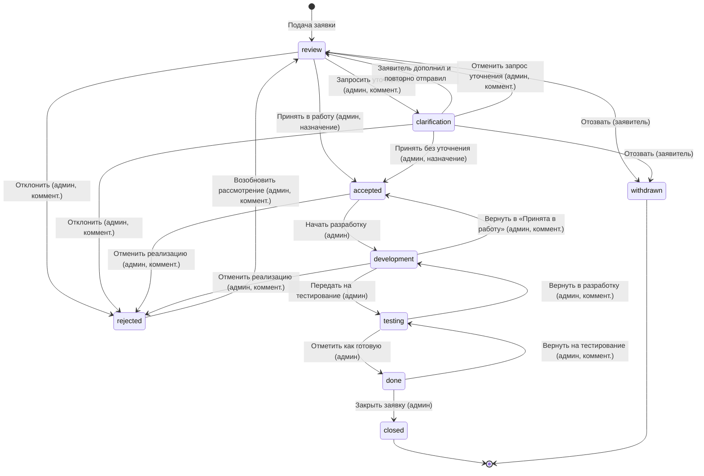

# Жизненный цикл заявки

Источник: `backend/app/services/workflow.py` (переходы администратора) и
`backend/app/services/requests.py` (`resubmit_request`, `withdraw_request`).

## Схема

## Статусы

| Статус | Код | Смысл |
|---|---|---|
| На рассмотрении | `review` | Заявка подана, ждёт решения администратора |
| Требуется уточнение | `clarification` | Админ запросил у заявителя дополнительную информацию |
| Принята в работу | `accepted` | Решение принято, назначен ответственный и срок |
| В разработке | `development` | Идёт реализация |
| Тестирование | `testing` | Решение проверяется перед сдачей |
| Готово | `done` | Реализовано, ожидает закрытия |
| Закрыта | `closed` | Финальный статус — работа завершена |
| Отклонена | `rejected` | Админ отказал; может быть возобновлена |
| Отозвана заявителем | `withdrawn` | Заявитель сам отменил заявку |

`closed` и `withdrawn` — терминальные, дальнейших переходов из них нет.

## Переходы администратора

Таблица переходов, которые доступен на карточке заявки администратору
(`ADMIN_TRANSITIONS` в `workflow.py`). Возврат назад или отказ всегда требует
комментария — он виден заявителю и остаётся в истории заявки.

| Из статуса | Кнопка | В статус | Комментарий обязателен | Нужно назначение (ответственный + срок) |
|---|---|---|---|---|
| `review` | Принять в работу | `accepted` | — | ✅ |
| `review` | Запросить уточнение | `clarification` | ✅ | — |
| `review` | Отклонить | `rejected` | ✅ | — |
| `clarification` | Принять в работу без уточнения | `accepted` | — | ✅ |
| `clarification` | Отменить запрос уточнения | `review` | ✅ | — |
| `clarification` | Отклонить | `rejected` | ✅ | — |
| `accepted` | Начать разработку | `development` | — | — |
| `accepted` | Отменить реализацию | `rejected` | ✅ | — |
| `development` | Передать на тестирование | `testing` | — | — |
| `development` | Вернуть в «Принята в работу» | `accepted` | ✅ | — |
| `development` | Отменить реализацию | `rejected` | ✅ | — |
| `testing` | Отметить как готовую | `done` | — | — |
| `testing` | Вернуть в разработку | `development` | ✅ | — |
| `done` | Закрыть заявку | `closed` | — | — |
| `done` | Вернуть на тестирование | `testing` | ✅ | — |
| `rejected` | Возобновить рассмотрение | `review` | ✅ | — |

## Действия заявителя

Доступны только автору заявки, не администратору:

- **Отозвать заявку** (`withdraw`) — только пока статус `review` или `clarification`
  (`APPLICANT_WITHDRAWABLE`). После взятия в работу отозвать нельзя — нужно
  написать комментарий администратору.
- **Дополнить и повторно отправить** (`resubmit`) — только пока статус
  `clarification`. Возвращает заявку в `review`, сбрасывает срок рассмотрения
  (`review_due_date`) и отметку «просмотрена админом» (`first_viewed_at`).

## Смежные эффекты переходов

- `accepted`/`clarification → accepted` требуют указать ответственного и срок
  реализации (срок не может быть в прошлом).
- Срок и ответственного также можно менять отдельно, пока заявка «в работе»
  (`accepted`, `development`, `testing`) — через `change_assignment`, без смены
  статуса.
- Срок рассмотрения (`review_due_date`) считается в рабочих днях по
  производственному календарю (см. `calendar.py`) при подаче и при повторной
  подаче после уточнения.
- Все переходы защищены optimistic-locking по полю `version` — устаревший
  запрос вернёт 409 с просьбой обновить страницу.
